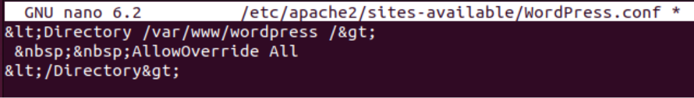

# Proyecto DAW
#### Proyecto del módulo Despliegue de Aplicaciones Web

## Instalación de Apache:
```bash
sudo apt update
sudo apt install apache2
```
## Activación de los módulos necesarios para ejecutar PHP y acceder a MySql
### Instalación de MySql:
```bash
sudo apt install mysql-server
```
### Instalación de PHP:
```bash
sudo apt install php libapache2-mod-php php-mysql
```
## Comprobamos la instalación:

## Instalando y cofigurando WordPress:
### Creamos un archivo WordPress.conf
```bash
sudo nano /etc/apache2/sites-available/WordPress.conf
```
Añadimos estas líneas al fichero:


### Creamos un directorio para WordPress y activamos "mod_rewrite"
#### A partir de ahora los comandos ilustrados son ejecutados con usuario root.


### Añadimos al fichero /etc/hosts estos dos dominios (centro.intranet y departamentos.centro.intranet):


### Activamos el módulo "wsgi" para permitir la ejecución de aplicaciones Python.
```bash
apt install libapache2-mod-wsgi-py3 -y
```


### Creamos y desplegamos una pequeña aplicación python para comprobar que funciona correctamente.
