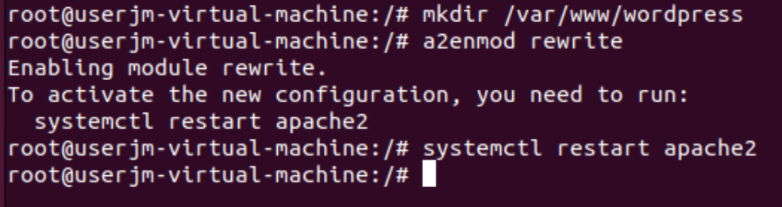
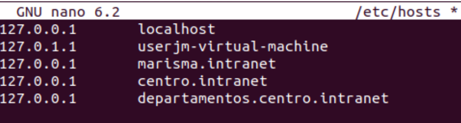

# Proyecto DAW
#### Proyecto del módulo Despliegue de Aplicaciones Web

## Instalación de Apache:
```bash
sudo apt update
sudo apt install apache2
```
## Activación de los módulos necesarios para ejecutar PHP y acceder a MySql
### Instalación de MySql:
```bash
sudo apt install mysql-server
```
### Instalación de PHP:
```bash
sudo apt install php libapache2-mod-php php-mysql
```
## Comprobamos la instalación:

## Instalando y cofigurando WordPress:
```bash
sudo mkdir -p /srv/www
sudo chown www-data: /srv/www
sudo apt install curl
curl https://wordpress.org/latest.tar.gz | sudo -u www-data tar zx -C /srv/www
```
### Creamos un archivo WordPress.conf
```bash
sudo nano /etc/apache2/sites-available/wordPress.conf
```


### Añadimos estas líneas al fichero:


### Habilitamos el sitio con:
```bash
sudo a2ensite wordpress
```
### Habilitamos la reescritura de URL con:
```bash
sudo a2enmod rewrite
```
### Desactivamos el sitio predeterminado "It Works" para agregar un nombre de host para que WordPress responda a las solicitudes:
```bash
sudo a2dissite 000-default
```
### En el fichero _ wordpress.conf _ añadimos:
```bash
<VirtualHost *:80>
    ServerName hostname.example.com
    ... # el resto de la configuración de VHost
</VirtualHost>
```
#### A partir de ahora los comandos ilustrados son ejecutados con usuario root.


### Añadimos al fichero /etc/hosts estos dos dominios (centro.intranet y departamentos.centro.intranet):


### Activamos el módulo "wsgi" para permitir la ejecución de aplicaciones Python.
```bash
apt install libapache2-mod-wsgi-py3 -y
```


### Creamos y desplegamos una pequeña aplicación python para comprobar que funciona correctamente.

