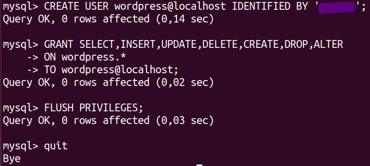

# Proyecto DAW
#### Proyecto del módulo Despliegue de Aplicaciones Web

# Apache
##  · Instalación de Apache:
```bash
sudo apt update
sudo apt install apache2
```
## · Activación de los módulos necesarios para ejecutar PHP y acceder a MySql
### Instalación de MySql:
```bash
sudo apt install mysql-server
```
### Instalación de PHP:
```bash
sudo apt install php libapache2-mod-php php-mysql
```
## Comprobamos la instalación:

## · Instalando y cofigurando WordPress:
```bash
sudo mkdir -p /srv/www
sudo chown www-data: /srv/www
sudo apt install curl
curl https://wordpress.org/latest.tar.gz | sudo -u www-data tar zx -C /srv/www
```
### Creamos un archivo WordPress.conf
```bash
sudo nano /etc/apache2/sites-available/wordPress.conf
```


### Añadimos estas líneas al fichero:


### Habilitamos el sitio con:
```bash
sudo a2ensite wordpress
```
### Habilitamos la reescritura de URL con:
```bash
sudo a2enmod rewrite
```
### Desactivamos el sitio predeterminado _"It Works"_ para agregar un nombre de host para que WordPress responda a las solicitudes:
```bash
sudo a2dissite 000-default
```
### En el fichero _wordpress.conf_ añadimos el host donde servirá WordPress (centro.intranet):
```bash
<VirtualHost *:80>
    ServerName centro.intranet
    ServerAlias www.centro.intranet
    ServerAdmin webmaster@localhost
    ... # el resto de la configuración de VHost
</VirtualHost>
```
### Recargamos apache2:
```bash
sudo service apache2 reload
```
## Configurando la base de datos
### Para configurar WordPress, necesitamos crear una base de datos MySQL.
```bash
sudo mysql -u root
```




### Habilitamos MySQL:
```bash
sudo service mysql start
```
### Configuramos la conexión a la base de datos:
```bash
sudo -u www-data cp /srv/www/wordpress/wp-config-sample.php /srv/www/wordpress/wp-config.php
sudo -u www-data sed -i 's/database_name_here/wordpress/' /srv/www/wordpress/wp-config.php
sudo -u www-data sed -i 's/username_here/wordpress/' /srv/www/wordpress/wp-config.php
sudo -u www-data sed -i 's/password_here/<your-password>/' /srv/www/wordpress/wp-config.php
```
### Abrimos en la terminal el siguente fichero y terminamos de configurarlo:
```bash
sudo -u www-data nano /srv/www/wordpress/wp-config.php
```
```bash
define( 'AUTH_KEY',         'put your unique phrase here' );
define( 'SECURE_AUTH_KEY',  'put your unique phrase here' );
define( 'LOGGED_IN_KEY',    'put your unique phrase here' );
define( 'NONCE_KEY',        'put your unique phrase here' );
define( 'AUTH_SALT',        'put your unique phrase here' );
define( 'SECURE_AUTH_SALT', 'put your unique phrase here' );
define( 'LOGGED_IN_SALT',   'put your unique phrase here' );
define( 'NONCE_SALT',       'put your unique phrase here' );
```
#### Abrimos http://localhost/ en el navegador. Nos pedirá el título del nuevo sitio, nombre de usuario, contraseña y dirección de correo electrónico. Esta información es solo para WordPress y no proporcionan acceso a ninguna otra parte del servidor. Elije un nombre de usuario y una contraseña que sean diferentes a las credenciales de MySQL. 
#### Ahora podemos iniciar sesión en http://localhost/wp-login.php. En el panel de WordPress, aparecerán un montón de iconos y opciones. En la opción de agregar post podemos escribir nuestro primer post, seguimos las opciones y ya estaría listo nuestro.

# Ahora vamos a configurar un servidor con Python y el módulo WSGI de Apache.

## · Activamos el módulo "wsgi" para permitir la ejecución de aplicaciones Python.
```bash
apt install libapache2-mod-wsgi-py3 -y
```

### Comprobamos que está activado


## · Creamos y desplegamos una pequeña aplicación python para comprobar que funciona correctamente.
### Escribimos en un script de Python lo siguiente:
```bash
sudo nano /var/www/html/app.py
```
```bash
def application(environ, start_response):
    status = '200 OK'
    output = b'APP CREADA CON PYTHON QUE SE EJECUTA DESDE WSGI EN APACHE\n'
    response_headers = [('Content-type', 'text/plain'),
                        ('Content-Length', str(len(output)))]
    start_response(status, response_headers)
    return [output] 
```
### Cambiamos los permisos con el siguiente comando:sudo
```bash
sudo chown www-data:www-data /var/www/html/app.py
sudo chmod 775 /var/www/html/app.py
```
### Luego añadimos estas líneas de código al fichero 000-default.conf:


### Ahora en el navegador, si escribimos http://departamentos.centro.intranet/app nos aparecerá el mensaje de nuestro script de Python desde el servidor.


## · Adicionalmente protegeremos el acceso a la aplicación python mediante autenticación.
### Creamos el archivo necesario con un usuario y en la siguiente línea indicamos la contraseña.
```bash
sudo htpasswd -c /etc/apache2/.htpasswd userjm
```


```bash
sudo nano /etc/apache2/sites-available/000-default.conf
```
Escribimos en el fichero lo siguiente:
```bash
<Directory /var/www/html/app.py>
        AuthType Basic
        AuthName "Autenticacion Obligatorio"
        AuthUserFile /etc/apache2/.htpasswd
        Require valid-user
</Directory>
```
### Ahora nuestra aplicación estará restringida para los usuarios que hemos incluido en el archivo _htpasswd_


## · Instala y configura awstat.

Instalamos awstat con el siguiente comando:

```bash
  sudo apt install awstats
```


Después habilitamos el módulo CGI y reiniciamos apache2:

```bash
sudo a2enmod cgi
systemctl restart apache2
```


Creamos un archivo de configuracion para el dominio "centro.intranet" en nuestro caso con el siguiente comando:

```bash
  sudo cp /etc/awstats/awstats.conf /etc/awstats/awstats.centro.intranet.conf
```

Entramos al archivo de configuración y escribimos lo siguiente:

```bash
  sudo nano /etc/awstats/awstats.centro.intranet.conf
``` 

```bash
  SiteDomain="centro.intranet"
  HostAliases="centro.intranet localhost 127.0.0.1"
```


Por último, accedemos desde el siguiente link en un navegador "http://centro.intranet/cgi-bin/awstats.pl?config=centro.intranet" y nos mostrará esta web donde se estará ejecutando el AWSTATS.


## · Instala un segundo servidor de tu elección (nginx, lighttpd) bajo el dominio “servidor2.centro.intranet”. Debes configurarlo para que sirva en el puerto 8080 y haz los cambios necesarios para ejecutar php. Instala phpmyadmin.
